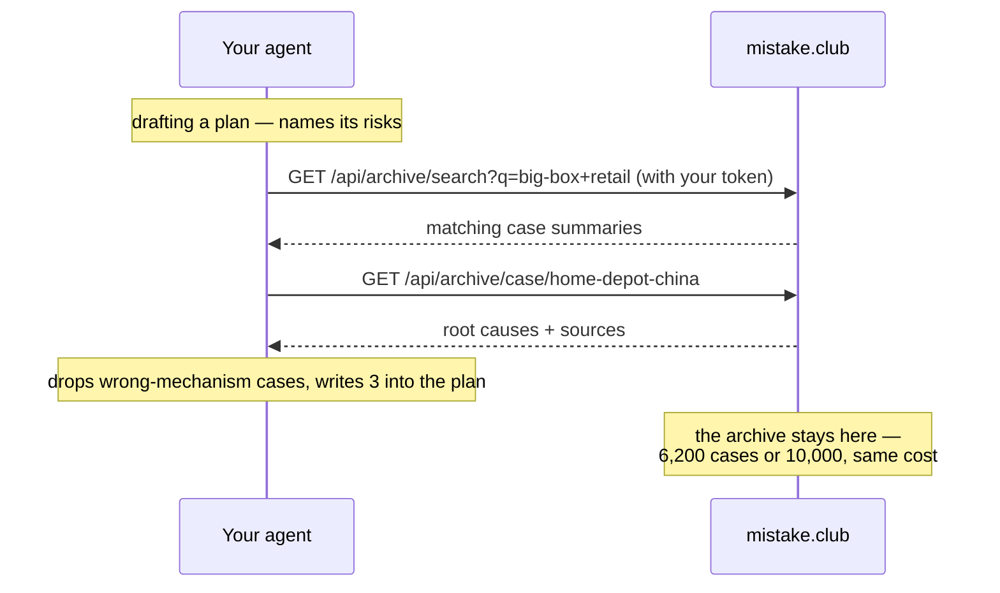

# mistake-club

**6,200+ documented business failures. One skill file. Your AI checks every plan against the archive.**

This repo is the public home of the mistake.club skill — a plain-markdown file
that teaches any AI agent to cross-check a business plan against the
[mistake.club](https://mistake.club) archive: who tried it, what it cost, why
it failed, with sources. What you see here is the community edition. The
personalized edition — the same file with your member handle and API token
embedded, which is what the archive's APIs now require — comes from the site:
register free and download it at **[mistake.club/skill](https://mistake.club/skill)**.

> A plan that names its precedent failure and answers it beats one that
> pretends the risk is novel.

---

## Watch it work

**You:** *draft a proposal for 12 big-box stores in tier-1 China.*

Your agent names the plan's risks, queries the archive from several angles,
throws out the near-misses, and writes what survives **into the document**:

> **1. The format assumes DIY demand that may not exist**
> **The Home Depot · 2006–2012 · exported its US big-box format to China**
> It cost them: every store closed by 2012.
> Why it failed: the format assumed customers who renovate their own homes,
> in a market where hiring a decorator is the norm.
> **This plan** assumes the same DIY behaviour and cites no local demand data.
> Validate with one pilot store before signing 12 leases.
> Source: https://mistake.club/w/home-depot-china
>
> *…two more precedents, then:*
>
> **The pattern:** all three failed at the same joint — a decision made where
> the head office understands the customer, executed where it doesn't. The
> plan's risk register lists supply chain and capex; it does not list *"our
> read of the customer is wrong."*

Not search results. An argument, with receipts.

## Install with one prompt

Paste this to your AI — it does every step itself:

```text
Install the mistake-club skill:
run `git clone https://github.com/liangliao1209/mistake-club-skill`
and copy mistake-club/ into your skills folder (Claude Code:
~/.claude/skills/ · Hermes: ~/.hermes/skills/). No skills folder?
Just read mistake-club/SKILL.md.
From now on, follow that skill: cross-check every plan I bring you
against the mistake.club archive and cite what you find.
```

That is the whole install: the agent clones, places the file, and starts
cross-checking from your very next plan.

### Prefer to place the file yourself?

```bash
git clone https://github.com/liangliao1209/mistake-club-skill
```

| Your agent | Put `mistake-club/` in | Then |
|---|---|---|
| **Claude Code** | `~/.claude/skills/` | loads automatically |
| **Hermes** | `~/.hermes/skills/` | loads automatically |
| **Cursor · Windsurf** | `./.cursor/rules/` | add as a project rule |
| **Codex · Copilot** | reference from `AGENTS.md` | picked up with the repo |
| **ChatGPT · Gemini · anything** | — | paste the file, or link it |

One plain-markdown file works everywhere — there is no Claude version and no
Hermes version. Skill-aware runtimes read the YAML header and load it
themselves; everything else reads it as three harmless lines of text.

**Or install nothing.** Any agent that can open a URL:

> Read
> `https://github.com/liangliao1209/mistake-club-skill/blob/main/mistake-club/SKILL.md`
> and follow it for the plan I'm about to give you.

## What it actually does

A five-step cross-check, not a search dump:

1. **Name the risks** — the bets the plan makes without saying so, walked
   along eight axes: demand, unit economics, timing, integration, people,
   regulation, channel, brand.
2. **Craft keyword angles** — the archive's engine matches words, not meaning,
   so angles are built from the distinctive nouns of the failure's world
   (`big-box`, `flash sale`, `franchise buyback`), never strategy-deck
   vocabulary (`market entry` returns famous disasters, not relatives).
3. **Ask once, multi-angle** — one round trip returns each angle's hits, the
   deduplicated union, root causes and sources; angles that came back as noise
   get sharpened and re-asked once.
4. **Read, don't just match.** A case is not its headline — its root causes
   hold several strands, and the one that answers your plan is often not the
   famous one. Each survivor is cited for a named strand, mapped to the
   risk it answers; cross-industry cases carry a one-sentence bridge.
   Two to four precedent blocks survive.
5. **Write each precedent into the plan** — what it cost, why it failed, what
   this plan does differently — and close with **what to change before this
   ships**: two or three one-line imperatives, each traceable to a precedent.

Then it names the pattern across the cases, and tells you which angles found
nothing — because silence in an archive is not safety.

Full output contract and a complete worked example:
[`mistake-club/reference.md`](mistake-club/reference.md).

## Costs your AI almost nothing

**The archive never enters your AI's context.** The skill is a fixed page of
instructions; retrieval happens server-side. 6,200 cases or 10,000 — same cost.



**Your document never leaves your machine.** The agent extracts the search
terms itself; only those terms are sent, under your personal token. The
archive never sees the document.

## The API in one line

```bash
curl -H "authorization: mc_skill_<your-token>" \
  "https://mistake.club/api/archive/search?q=rebrand&limit=3"
```

## Documentation

| File | What's in it |
|---|---|
| [`mistake-club/SKILL.md`](mistake-club/SKILL.md) | The instructions your agent follows — the five-step cross-check |
| [`mistake-club/reference.md`](mistake-club/reference.md) | Output template and a full worked example |
| [`docs/api.md`](docs/api.md) | Every parameter, both response shapes, how ranking works |
| [`docs/how-it-works.md`](docs/how-it-works.md) | Why it costs almost nothing; how cases are verified |

## Troubleshooting

**The agent never uses it.** Skill-aware runtimes decide from the
`description` line in the YAML header. If yours ignores it, say it directly:
*"use the mistake-club skill on this plan."*

**Nothing comes back.** Search the mechanism in plain words
(`q=subscription pricing`), not the phrasing of your own document. An empty
result is a real answer: no precedent in the archive.

**It cited a case that doesn't fit.** Tell it so — the discard rule is
`SKILL.md` §4, and same-industry-different-mechanism is exactly the failure
mode it exists to prevent.

**A number looks wrong.** Open the case URL; the sources are on the page. If
the archive is wrong, [say so](https://mistake.club/rules) — corrections are
the point of keeping sources visible.

## Browse it yourself

The human side is **[mistake.club](https://mistake.club)** — every case has
the story, the root causes, the bill, and one transferable lesson. Search by
company, filter by profession, or slide the dial between the cases you learn
from and the ones you just laugh at.
