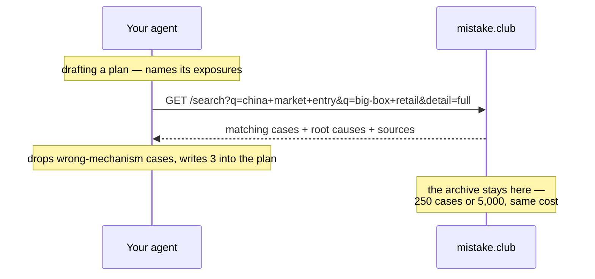

# mistake-club — cross-check any plan against what already failed

A skill that connects your AI agent to **[mistake.club](https://mistake.club)** —
a working encyclopedia of documented business failures, searchable by company,
profession and decision type.

Install it once and it becomes part of how your AI works. Whenever you draft a
proposal, a strategy document, a market-entry plan, a consulting deliverable or
an investment memo, the agent finds the organisations that **already tried the
same thing**, and writes their outcome into your document — with the figure it
cost them and a link to the sources.

A plan that names its precedent failure and answers it beats one that pretends
the risk is novel.

## One file, any agent

There is no Claude version and no Hermes version — `mistake-club/SKILL.md` is
plain markdown: a workflow, an API and an output contract. The only thing that
differs between tools is which folder it belongs in.

```bash
git clone https://github.com/liangliao1209/mistake-club-skill
```

| Agent | Put `mistake-club/` in | Then |
|---|---|---|
| Claude Code | `~/.claude/skills/` | loads automatically |
| Hermes | `~/.hermes/skills/` | loads automatically |
| Cursor · Windsurf | `./.cursor/rules/` | add as a project rule |
| Codex · Copilot | reference it from `AGENTS.md` | picked up with the repo |
| ChatGPT · Gemini · anything else | — | paste the file, or link it |

The YAML block at the top of `SKILL.md` is what lets skill-aware runtimes load
it by themselves. Every other tool reads it as three harmless lines of text, so
the same file works everywhere.

**Or install nothing.** Any agent that can open a URL:

> Read
> `https://github.com/liangliao1209/mistake-club-skill/blob/main/mistake-club/SKILL.md`
> and follow it for the plan I'm about to give you.

## What it does, exactly

It does not dump search results. It runs a five-step cross-check:

1. **Names the exposures** in your plan — the specific decisions that could go
   wrong, not the topics.
2. **Turns each into query angles** — the mechanism in plain words, the format,
   a comparable company, the function, the decision type.
3. **Asks once**, multi-angle, and gets back the matching cases with their root
   causes and sources.
4. **Drops the near-misses.** Same industry is not a precedent; same *mechanism*
   is. Two to four cases survive.
5. **Writes each precedent into the plan** with what it cost, why it failed, and
   — the line that matters — what your plan does differently.

Then it names the pattern across those cases, and tells you which angles found
nothing, because silence in an archive is not safety.

The full output template and a worked example live in
[`mistake-club/reference.md`](mistake-club/reference.md).

## A real cross-check

> **You:** draft a proposal for 12 big-box stores in tier-1 China.

The agent queries three angles and gets back six cases. It keeps three —
dropping Toshiba's nuclear write-off and Yum's China spin-off as wrong-mechanism
— and writes:

> **1. The format assumes DIY demand that may not exist**
> **The Home Depot · 2006–2012 · exported its US big-box DIY format to China**
> It cost them: all big-box stores closed by 2012
> Why it failed: the format assumed customers who renovate their own homes, in a
> market where hiring a decorator is the norm.
> **This plan:** assumes the same DIY behaviour and cites no local demand data.
> Validate with one pilot store before signing 12 leases.
> Source: https://mistake.club/w/home-depot-china
>
> *…two more precedents, then:*
>
> **The pattern:** all three failed at the same joint — a decision made where
> the head office understands the customer, executed where it doesn't. The
> plan's risk register lists supply chain and capex; it does not list "our read
> of the customer is wrong".

## Why it costs your AI almost nothing

This is retrieval, not memorisation. **The archive stays on the server and is
never loaded into your AI's context.** The skill file is a fixed page of
instructions that does not grow, whether the archive holds 250 cases or 5,000.



**Your document never leaves your machine.** The agent extracts the search terms
itself; only those terms are sent. No account, no telemetry, nothing logged
about who is asking.

## Documentation

| File | What is in it |
|---|---|
| [`mistake-club/SKILL.md`](mistake-club/SKILL.md) | The instructions your agent follows — the five-step cross-check, the query grammar, the rules. |
| [`mistake-club/reference.md`](mistake-club/reference.md) | The output template and a full worked example, including which cases were discarded and why. |
| [`docs/api.md`](docs/api.md) | Complete API reference: every parameter, both response shapes, how ranking works, what each field means. |
| [`docs/how-it-works.md`](docs/how-it-works.md) | Why it costs your agent almost nothing, how cases are verified before publication, and what the server never sees. |

## The API in one line

```bash
curl "https://mistake.club/api/big-mistakes/search?q=rebrand&limit=3"
```

Repeat `q` to ask several angles at once, add `detail=full` for root causes and
sources. Full reference in [`docs/api.md`](docs/api.md).

## Troubleshooting

**The agent never uses it.** Skill-aware runtimes decide from the `description`
line in the YAML header. If yours is ignoring it, name it directly: *"use the
mistake-club skill on this plan."*

**Nothing comes back.** Your angles may be too specific. Search the mechanism in
plain words (`q=subscription pricing`) rather than the phrasing of your own
document. An empty result is a real answer: no precedent in the archive.

**It cited a case that doesn't fit.** Tell it so — the discard rule is in
`SKILL.md` §4, and same-industry-different-mechanism is the failure mode it is
written to prevent.

**A number looks wrong.** Open the case URL; the sources are on the page. If the
archive is wrong, [say so](https://mistake.club/rules) — corrections are the
point of keeping sources visible.

## Browse the archive

The human-readable side is at **[mistake.club](https://mistake.club)** — every
case has the story, the root causes, the bill, and one transferable lesson.
Search by company, filter by profession, or slide the dial between the cases
you learn from and the ones you just laugh at.
