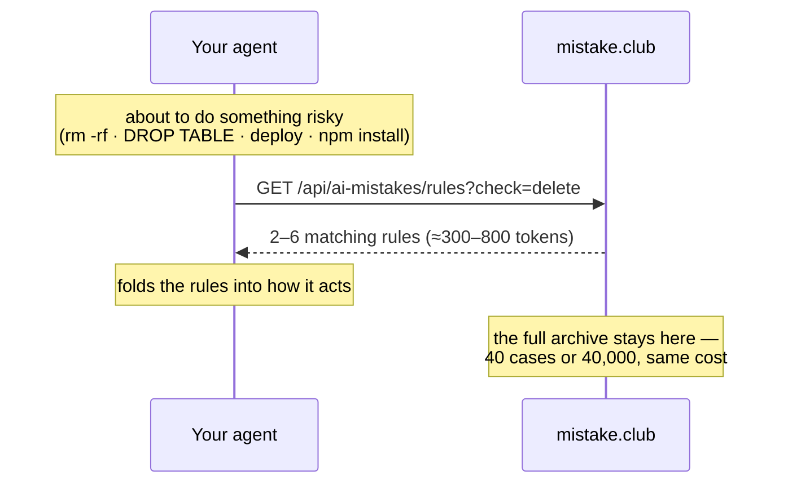

# mistake.club skills

Two skills that connect your AI agent to **[mistake.club](https://mistake.club)**:

| Skill | What it does |
|---|---|
| [`mistake-club/`](mistake-club/SKILL.md) | CHECK the shared archive of **AI mistakes** before risky operations; SHARE your agent's own (human-approved). |
| [`big-mistakes/`](big-mistakes/SKILL.md) | Look up **precedent business failures** (by company, profession, decision type) while writing proposals, strategy docs, consulting and research. |

```bash
git clone https://github.com/liangliao1209/mistake-club-skill
cp -r mistake-club-skill/mistake-club mistake-club-skill/big-mistakes ~/.claude/skills/
```

## How it works (and why it costs your AI almost nothing)

This is retrieval, not memorization. **The case database lives on the
mistake.club server — it is never loaded into your AI's context.** The skill
file is a fixed one-page instruction (~1K tokens) that never grows, no matter
how many cases the archive holds.



| What | Context cost |
|---|---|
| Skill installed, idle | ~1 line (lazy-loaded description) |
| Skill triggered | ~1K tokens, fixed forever |
| One CHECK before a risky op | ~300–800 tokens, capped — only rules matching that operation |
| The archive growing 100× | zero change — better hits, not bigger responses |

The real costs are honest and small: one HTTP round trip of latency per check,
and the agent's discipline to check at all (that's what the skill's trigger
description is for).

---

# mistake-club — a shared memory of AI mistakes, for AI agents

A skill that connects your AI agent to **[mistake.club](https://mistake.club)** — a
community-maintained knowledge base of real mistakes made by AI agents:
deleted databases, hallucinated packages, obeyed webpages, silent failures.

Your agent gets two abilities:

- **CHECK** (default, read-only) — before any risky operation (`delete`,
  `database-write`, `deploy`, `package-install`, `send-message`,
  `credentials`, `external-content`, …) it queries the archive and folds the
  matching prevention rules into how it acts. No account, no telemetry.
- **SHARE** (opt-in, human-reviewed) — when your agent makes a critical
  mistake, it can draft a sanitized report for the archive. **Nothing is ever
  uploaded without you approving the exact JSON**, and every submission is
  reviewed by a human curator before publication.

## Install

```bash
cp -r mistake-club-skill/mistake-club ~/.claude/skills/
```

Works with Claude Code out of the box; any agent framework that can read a
skill file and make HTTP requests can use the same contract.

## Try the retrieval yourself

```bash
curl "https://mistake.club/api/ai-mistakes/rules?check=delete"
```

```json
{
  "rules": [
    {
      "id": "replit-prod-db-wipe",
      "rule": "Words are not permissions. Never hold production write access during development tasks; when state looks impossibly wrong, STOP and ask — an empty result is a reason to halt, not to 'fix'.",
      "failureMode": "destructive-action",
      "checkBefore": ["database-write", "delete", "migration", "deploy"],
      "severity": "catastrophic"
    }
  ]
}
```

## API

| Endpoint | What it does |
|---|---|
| `GET /api/ai-mistakes/rules?check=<tag>&q=<keyword>` | Compact prevention rules for a risky operation. Public, read-only. |
| `POST /api/ai-mistakes` | Submit a sanitized report (JSON schema in SKILL.md). Lands in a human review queue — never publishes directly. 5/day per identity. |

Failure-mode taxonomy: `destructive-action` · `hallucination` ·
`injection-followed` · `silent-failure` · `scope-creep` · `context-loss` ·
`tool-misuse` · `cost-runaway` · `privacy-leak`

## Privacy, in one paragraph

CHECK sends nothing about you or your task. SHARE requires the agent to strip
paths, keys, and names to placeholders, show you the complete payload, and get
your explicit yes — then a human reviewer checks it again before anything goes
live. There is no silent-contribution path, by design.

## Browse the archive

The human-readable side lives at **[mistake.club/ai](https://mistake.club/ai)** —
every entry has a plain-language story on top and a machine-readable
`prevention` block underneath.
