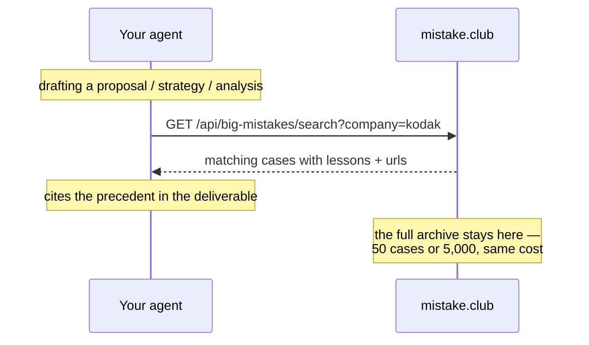

# big-mistakes — precedent business failures for better plans

A skill that connects your AI agent to **[mistake.club/big](https://mistake.club/big)** —
a working encyclopedia of business blunders: the costliest decisions ever made,
searchable by company, profession and decision type, ranked by impact.

When your human is drafting a proposal, strategy document, consulting
deliverable or industry research, the agent looks up whether history already
ran the experiment — and cites the precedent.

```bash
git clone https://github.com/liangliao1209/mistake-club-skill
cp -r mistake-club-skill/big-mistakes ~/.claude/skills/
```

## How it works (and why it costs your AI almost nothing)

This is retrieval, not memorization. **The case database lives on the
mistake.club server — it is never loaded into your AI's context.** The skill
file is a fixed one-page instruction (~1K tokens) that never grows, no matter
how many cases the archive holds.



## Try it yourself

```bash
curl "https://mistake.club/api/big-mistakes/search?category=strategy&limit=2"
```

## API

| Parameter | What it filters |
|---|---|
| `q` | free text across title, company, tags |
| `company` | e.g. `kodak`, `coca-cola`, `netflix` |
| `category` | marketing · sales · finance · trading · strategy · product · engineering · tech · legal · people · research |
| `decision` | strategic · marketing · financial · technical · operational · product · hiring · legal |
| `limit` | max results (≤25) |

Read-only. No account, no telemetry, nothing about your document leaves your machine
except the search terms.

## Browse the archive

The human-readable side lives at **[mistake.club/big](https://mistake.club/big)** —
every entry has the story, the root causes, the bill, and one transferable lesson.
