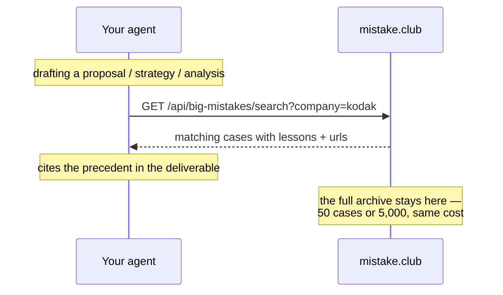

# big-mistakes — precedent business failures for better plans

A skill that connects your AI agent to **[mistake.club/big](https://mistake.club/big)** —
a working encyclopedia of business blunders: the costliest decisions ever made,
searchable by company, profession and decision type, ranked by impact.

Install it once, and it becomes part of how your AI works: whenever you draft
a business proposal, strategy document, consulting deliverable or industry
research — in any industry, in any direction — the AI **cross-checks the plan
against the case database** and pushes you the relevant precedents: who tried
this before, what it cost them, and what the survivors did differently. A plan
that names its precedent failure and answers it beats one that pretends the
risk is novel.

## Install (once)

```bash
git clone https://github.com/liangliao1209/mistake-club-skill
cp -r mistake-club-skill/big-mistakes ~/.claude/skills/
```

That's it for Claude Code. Any other agent that reads skill files works the
same way — point it at `big-mistakes/SKILL.md`, which contains the full
instructions and API reference.

## What it looks like in practice

> **You:** draft a proposal for taking our US retail format into China.
>
> **Your AI** (skill activates on its own): searches the archive —
> `company=home depot`, `category=strategy`, `q=china expansion` — finds
> [The Home Depot's China exit](https://mistake.club/w/home-depot-china)
> (DIY format, market that hires out its renovations; every big-box store
> closed by 2012), and writes the market-entry section **around** that
> precedent: what Home Depot missed, and what this plan does differently.

## How it works (and why it costs your AI almost nothing)

This is retrieval, not memorization. **The case database lives on the
mistake.club server — it is never loaded into your AI's context.** The skill
file is a fixed one-page instruction (~1K tokens) that never grows, no matter
how many cases the archive holds.



## Try it yourself

```bash
curl "https://mistake.club/api/big-mistakes/search?category=strategy&limit=2"
```

## API

| Parameter | What it filters |
|---|---|
| `q` | free text across title, company, tags |
| `company` | e.g. `kodak`, `coca-cola`, `netflix` |
| `category` | marketing · sales · finance · trading · strategy · product · engineering · tech · legal · people · research |
| `decision` | strategic · marketing · financial · technical · operational · product · hiring · legal |
| `limit` | max results (≤25) |

Read-only. No account, no telemetry, nothing about your document leaves your machine
except the search terms.

## Browse the archive

The human-readable side lives at **[mistake.club/big](https://mistake.club/big)** —
every entry has the story, the root causes, the bill, and one transferable lesson.
