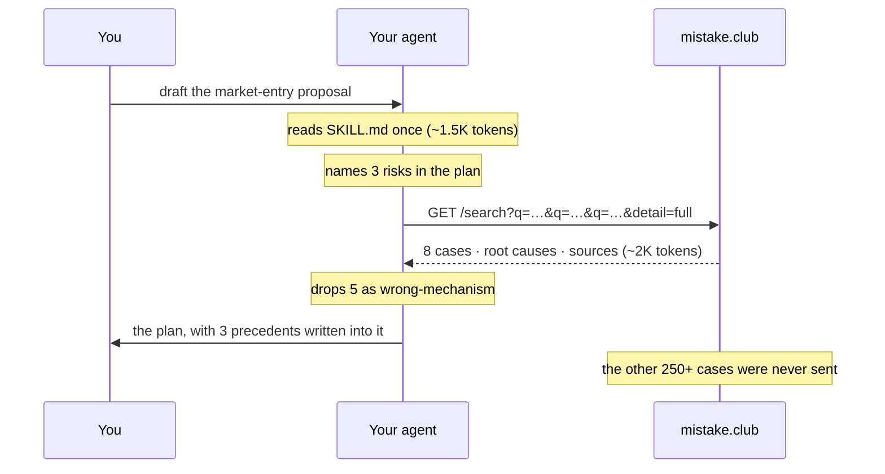

# How it works

Three questions people ask before they trust a skill with their work: what does
it cost my agent, where does the content come from, and what happens to my
document. In order.

---

## 1. It costs your agent almost nothing

This is retrieval, not memorisation. **The archive never enters your agent's
context.** What you install is a fixed page of instructions — a workflow, an
API and an output contract — that stays the same size whether the archive holds
250 cases or 5,000.

Per cross-check the agent pays for the skill file plus one response. Nothing
accumulates between runs.

## 2. Where the cases come from

Every case in the archive passes the same gates before it is published:

| Gate | What it enforces |
|---|---|
| Schema | Field lengths, an enum category and decision type, a `trigger` under 40 characters, `significance` 1–100. |
| Sentence integrity | No field may be cut mid-sentence. Over-long text is rewritten, never truncated. |
| Sources live | Every source URL is fetched and must return 200. Fabricated links do not survive. |
| Two sources above 70 | A case rated highly must be documented in two independent places, or the rating comes down. |
| Primary document for fatalities | Where people died, a regulator's notice, court filing or accident report is required — an encyclopedia page is not enough. |
| No duplicates | Same organisation, overlapping years — the case already exists; a rewrite is rejected. |
| Tone law | Where there were casualties the entry stays sober: no jokes, and a human life is never priced as "the cost". |
| Human read | Sensitive subjects and anything the machine flags are read by a person before publication. |

What the archive deliberately excludes: politics, war and national events;
programmes run by governments rather than businesses; harm to a specific ethnic
or vulnerable group; and anything without a verifiable source.

**It is still fallible.** Records get corrected and reporting gets retracted.
The skill's own rules tell your agent to open the sources before a figure goes
into a client deliverable — and every case page shows them.

## 3. Your document stays on your machine

The agent reads your plan locally, works out what to search for, and sends only
those search terms. The endpoint is a plain `GET` with a handful of words in the
query string.

There is no account, no API key, no cookie, and nothing logged that ties a
search to a person, a company or a document.

If your agent ever offers to POST the plan itself somewhere, that is not this
skill.

---

## Why "same mechanism, not same industry"

The instruction the skill spends the most words on is what to *discard*.

A retail chain that went bankrupt under a leveraged buyout is not a precedent
for a retail chain that misread demand. Both are retail; both are failures; the
mechanisms have nothing in common, and pasting the first into a plan about the
second is the kind of research that makes a reader stop trusting the document.

So the skill asks one question of every candidate case: **would this failure
have happened to this plan, for this reason?** Two to four survive. That is the
difference between a cross-check and a search-result dump.

## What it does when it finds nothing

It says so, in those words: *"no precedent in the archive for X."*

It is explicitly forbidden from turning silence into reassurance. An archive of
250 documented failures is not a census of everything that has ever gone wrong,
and the skill is written to keep that distinction visible to the reader.
